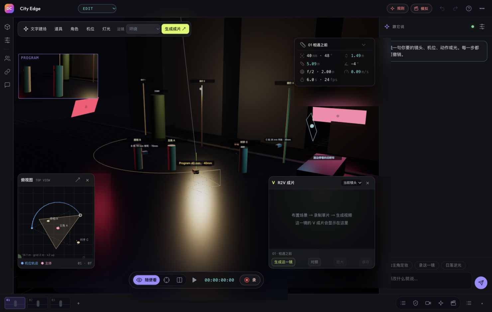

<p align="center">
  
</p>

<h1 align="center">导演台 · Director Console</h1>

<p align="center"><strong>先把镜头摆出来，再让 AI 拍出来。</strong></p>
<p align="center">从创意、3D 预演到 AI 视频生成，把你的镜头想法变成一条片子。</p>
<p align="center">A 3D directing workspace for AI filmmaking.</p>

<p align="center">
  <a href="#开始使用">开始使用</a> ·
  <a href="#看看实际效果">实际效果</a> ·
  <a href="#你可以用它做什么">核心功能</a> ·
  <a href="#文档与开发">开发文档</a> ·
  <a href="https://github.com/CristinaKepner/Director/issues">反馈建议</a>
</p>

---

**导演台是一套面向 AI 视频创作者的 3D 导演工作台。** 你可以先安排人物站位、机位、灯光和运镜，在舞台上预演并录制白模视频，再将镜头信息、参考图和参考视频交给生成模型，最后按分镜顺序导出成片。

适合做短片分镜、广告提案、产品视频，以及在正式生成前验证构图和剪辑节奏。支持 macOS 客户端，也可以从源码在浏览器中运行。

## 看看实际效果



*工作区截图来自 v0.9.3：同屏查看舞台、空间关系与生成结果。v0.9.5 已更新应用图标。*

### 一条 60 秒品牌概念短片

仓库记录了 **MAISON — 一线成形** 演示项目：从创意 brief 出发，完成 10 个镜头的分镜、白模预演、Seedance 生成和 1080p 成片导出。以下是生成结果的关键帧：


[查看完整制作过程与分镜 →](docs/tvc/README.md)

这是演示案例；制作记录也保留了失败重试与产品颜色漂移等问题，方便了解实际效果和迭代方法。

## 你可以用它做什么

| 能力 | 创作时怎么用 |
| --- | --- |
| **用自然语言指挥** | 让 Agent 帮你建场、安排分镜、修改机位与灯光；操作记录可查看、可撤销。复杂创意规划需要配置 LLM。 |
| **在 3D 中预演** | 摆人物、道具与相机，调整焦距、姿态、动线和运镜，先看构图与调度是否成立。 |
| **俯视图辅助调度** | 左下角查看人物站位、机位轨迹与视野，支持关闭、重新打开和放大。 |
| **录制白模参考** | 录下相机画面作为 Take，圈选满意的版本，提取关键帧进入故事版。 |
| **把镜头交给 AI 生成** | 从镜头数据编译提示词，调用 Ark 的 Seedance / Seedream，支持文生视频、图生视频、视频生视频与图片生成。 |
| **同屏查看生成结果** | 右下角 R2V 成片面板查看当前镜头或整片结果，支持播放、放大和保存。 |
| **参考资产复用** | 批准角色或产品参考图后，相关镜头生成时自动携带，辅助维持跨镜头一致性。 |
| **按分镜导出成片** | 将白模、生成素材或两者混合，按镜头顺序统一画幅与帧率后拼接导出。 |

### 从想法到成片

```text
创意 / 剧本
    ↓
建立场景与分镜 → 调整人物、机位、灯光与运镜
    ↓
录制白模 Take → 检查构图、调度和节奏
    ↓
逐镜 AI 生成 → 查看结果 → 修改并重跑某一镜
    ↓
按分镜导出成片
```

配置 LLM 后，可以尝试这样指挥：

> 为两个旅行中爱斗嘴的朋友设计一条 30 秒短片，先建立场景和分镜。
>
> 把 03 镜改成 50mm 环绕 120 度，并让主角举起手袋。
>
> 把机位降低到 0.4 米，换成日落逆光。

## 开始使用

### 浏览器体验

准备 **Node.js 18 或更新版本**，克隆后直接启动。前端依赖已随仓库提供，无需先安装根目录依赖。

```bash
git clone https://github.com/CristinaKepner/Director.git
cd Director
npm run dev
```

打开 **http://127.0.0.1:5175/web/**，从内置示例开始，调整机位、播放预演，熟悉工作区。

**不配置 API 密钥，也能体验 3D 舞台、分镜、白模录制与内置规则指令。** 真实 AI 生成和复杂自然语言规划需要你自己的服务凭据与可用额度；模拟任务不代表真实生成结果。

### macOS 客户端

支持 Apple Silicon 与 Intel，当前客户端源码版本为 **0.9.10**。客户端包含本地后端、原生菜单、工程库与偏好设置。

**目前仓库尚未发布可直接下载的 Release 安装包。** 可以在 Mac 上从源码运行：

```bash
cd desktop
npm install
npm start
```

自行构建 DMG（包含 FFmpeg）：

```bash
# 在 desktop/ 目录执行
npm run dist
```

安装包输出到 `desktop/dist/`。构建与更新源配置见[客户端分发指南](docs/distribution.md)。

### 接入真实生成

macOS 客户端：打开 **导演台 → 偏好设置（⌘,）**，配置火山 Ark 密钥、LLM 网关密钥与规划模型。

源码启动：将密钥分别保存在本地文件，再指定路径：

```bash
npm run dev -- --ark-key-file ~/.ark-key --llm-key-file ~/.aigw-key
```

- **Ark**：负责已接入的 Seedance 视频生成与 Seedream 图片生成，实际可用模型取决于你的服务权限。
- **LLM 网关**：负责理解复杂创作需求并规划操作；未配置时使用内置规则规划器。
- **视频参考与导出**：浏览器源码运行时需另行准备 FFmpeg；V2V 参考视频还需提供生成服务可访问的地址。配置方法见[后端与媒体发布文档](docs/backend-api.md)。

## 当前进展

- **v0.9.10**：支持 MossHub 网关与 `MOSSHUB_API_KEY` / `MOSSHUB_MODEL` 环境变量；启动时查询此 key 的模型列表，规划选择器排除图像和视频端点模型。
- **v0.9.9**：Take 支持恢复完整运镜轨迹（含关键帧、镜头与时长）、撤销恢复；比较 Take 时识别关键帧差异，Agent 恢复后可继续实际录制白模。
- **v0.9.8**：支持从「⋯ → 导出对话 JSON」导出当前保留的消息、方案、工具操作与媒体引用（最多 120 条；不恢复已丢失历史）。

- **v0.9.7**：聊天白模指令交由客户端实际录制，增加常驻任务状态、录制秒数与保存结果。

- **v0.9.6**：公网隧道失败后切换 HTTP/2 重试，生成面板展示具体连接错误，区分图片参考与视频参考。

- **v0.9.5**：全新石墨黑与黄绿场记板图标，统一桌面应用和网页标识。
- **v0.9.4**：V2V 参考视频提交前统一转为 30fps H.264，修复高帧率参考被 Seedance 拒绝的问题。
- **v0.9.3**：加入可开关的左下角俯视图、右下角 R2V 成片面板与舞台快捷工具栏。

当前真实生成接入为 **火山 Ark**；其他供应商入口仍为模拟队列。3D 预演用于提供构图、调度与参考，最终画面的遵循程度取决于生成模型。GLB / USD 资产导入等功能仍在规划中。

## 文档与开发

导演台的界面、CLI 和外部 Agent 共用同一套运行时与 Action 接口。后端保存工程状态，通过 REST / SSE 与前端同步；自动化可以直接操作场景、镜头、生成任务和成片流程。

```text
core/      场景数据、镜头、动作、提示词与撤销历史
web/       Three.js 舞台与导演工作区
server/    本地后端、生成适配器、媒体存储与 CLI
desktop/   macOS 客户端与打包配置
docs/      使用说明、制作案例与技术设计
```

| 想了解什么 | 从这里开始 |
| --- | --- |
| 使用流程 | [用户工作流](docs/user-flow.md) |
| 完整制作案例 | [60 秒 TVC 制作记录](docs/tvc/README.md) |
| 运行方式、CLI 与架构细节 | [技术参考](docs/technical-reference.md) |
| API、生成与媒体发布 | [后端接口文档](docs/backend-api.md) |
| Agent 执行与局部修改 | [Harness 设计](docs/harness.md) · [局部修改机制](docs/revision.md) |
| 客户端构建与分发 | [分发与更新](docs/distribution.md) |
| 产品方向 | [产品设计](PRODUCT.md) · [开发规格](director-console-development-spec.md) |

```bash
npm test          # 核心运行时与工作区逻辑
npm run test:api   # 后端、规划器、媒体与生成适配
npm run test:all   # 完整自动化测试
```

提示词模板参考 [awesome-seedance](https://github.com/LearnPrompt/awesome-seedance)，来源与许可记录在同步生成的模板库中。

---

如果导演台对你的创作有帮助，欢迎 **Star** 收藏，或通过 [Issues](https://github.com/CristinaKepner/Director/issues) 分享作品、使用反馈和功能建议。

**创作从这一帧开始。**
