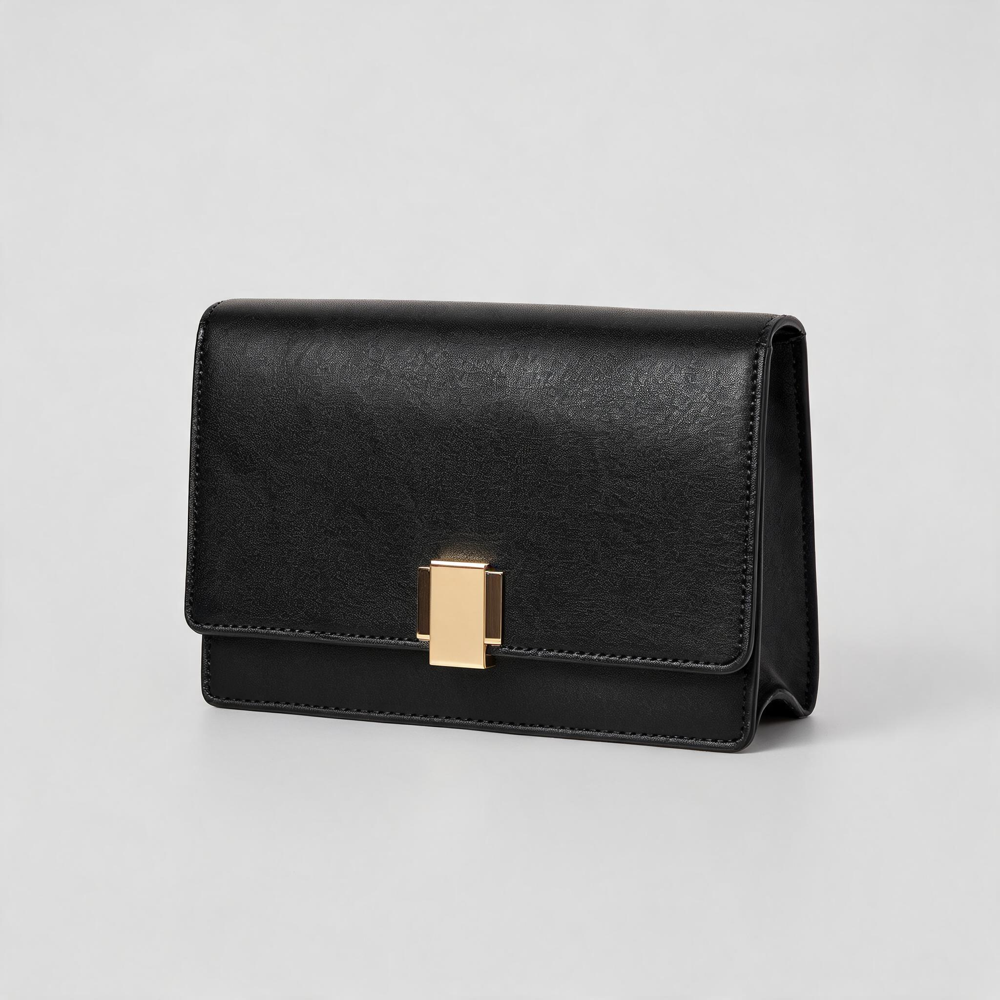
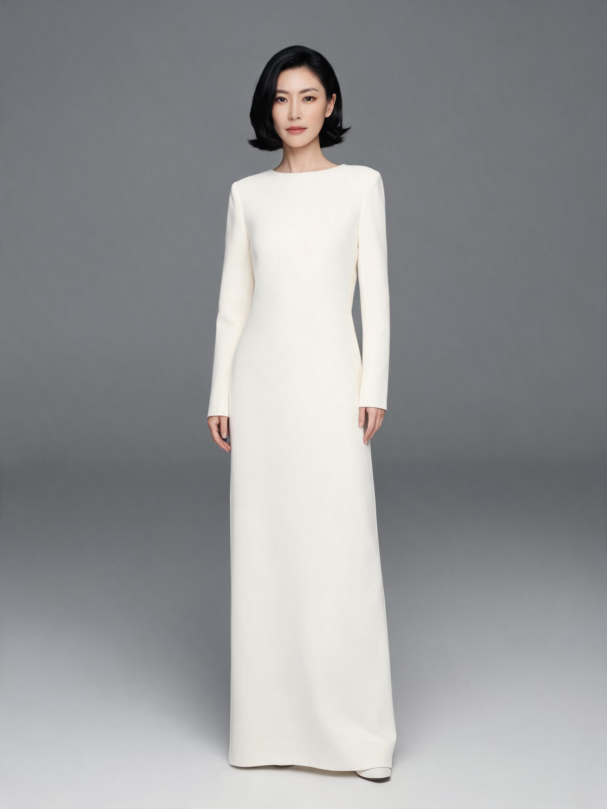
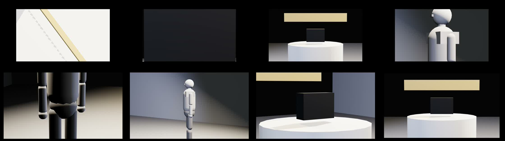
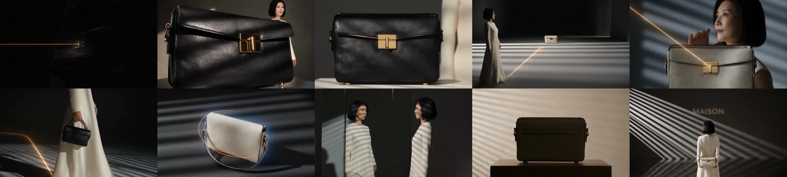

# 端到端记录：60 s 高端时尚品牌 TVC（macOS 客户端，2026-09-12）

一次从**一句 brief** 到**一条 60 秒成片**的完整走通，全程在 `desktop/`（导演台 macOS 客户端）里完成：
**brief → 分镜（LLM 规划）→ 白模 3D 预演 → 逐镜白模 Take → 白模成片 → 逐镜 Seedance 2.5 渲染 → 成片**。

工程 `MAISON — 一线成形 60s TVC`，10 镜 / 60.0 s / 16:9 / 24 fps。分镜表见 [`storyboard.md`](storyboard.md)。

> 这条片子以**演示工程**的形式留在客户端里：「工程 → 工程库 → MAISON — 60s TVC 演示」一键载入，10 个镜头、10 条白模 Take、10 条 Seedance 生成结果、两条成片和参考资产都在，可以直接播、直接看提示词、直接重跑任意一镜。

## 0. 起手

```bash
npm run dev -- --ark-key-file ~/.ark-key --llm-key-file ~/.aigw-key
# 或者直接开客户端（自带后端）：cd desktop && npm start，密钥在「导演台 → 偏好设置」里填
```

密钥两处都行：`~/.ark-key` / `~/.aigw-key`（CLI 习惯），或客户端偏好设置窗口（写进 `userData/keys/`，保存后自动重启后端）。

## 1. brief → 分镜（gpt-5.6-sol，72 s / 12.3k tokens）

输入原文：

> 请为我们的高端时尚品牌制作一条 60 秒 TVC 品牌短片，参考 Apple 的极简产品质感和 CHANEL 的经典优雅调性，要有故事创意和产品展示，适合信息流广告投放，画幅 16:9。给出分镜表

一次规划出 **49 个 Action，全部成功**：场景 + 房间 + noir 灯光预设 + 画幅/帧率/风格、6 个语义实体、5 盏灯、9 个机位、10 个镜头（时长加起来正好 60 s）、10 张故事版卡片，最后两步是产品与主角的参考图任务。

> **这里修了一个真实缺陷。** 第一次跑，模型只回了一段漂亮的文字分镜表、**一个 Action 都没建**——它把「给出分镜表」当成了提问。规划器的系统提示词原本写着「用户只是提问/闲聊/要建议时 steps 为空」，模型照做了。
> 改法（`server/src/adapters/llm.mjs`）：明确写清**描述一支片子、要分镜表 = 建场请求**，必须建进工程；缺品牌名这类信息用占位建出来、把假设写进 `notes`，不要停下来反问。改完同一句 brief 出 49 个 Action。

模型自己记下的假设：未提供品牌名与产品品类，以「MAISON」和黑色结构感手袋占位；参考品牌只转译成「极简产品摄影、黑白留白、经典法式优雅」等原创视觉属性。

## 2. 资产与一致性

规划的最后两步是 `generation.reference`，Seedream 5.0 出了产品定妆图和主角定妆图：

| 产品参考 | 主角参考 |
|---|---|
|  |  |

`asset.approve` 之后，这两张图绑在 `ent_hero_bag` / `ent_model` 上。后面每个镜头提交生成时，`referencesForShot()` 自动把该镜出现的实体的已批准参考塞进请求——本次 10 个任务每个都带了 4 张参考图，导演不用记得。

## 3. 白模 3D 预演 → 白模成片

客户端菜单「成片 → 录白模」：逐镜 `shot.select → take.record`，页面用 MediaRecorder 录 Program 画面，上传到后端 `/media/`，抓关键帧进故事版，自动 Circle。

10 镜全部录成，348–839 帧/条（真机 GPU，远高于无头 SwiftShader 的 67–98 帧）。耗时 **1 分 15 秒**。

「成片 → 导出成片」→ `film.export {source:"blockout"}` → ffmpeg：`MAISON_blockout.mp4`，1920×1080 / 24 fps / **59.9 s** / 5.7 MB。



白模片能直接看出剪辑节奏，也马上暴露了一条导演笔记：**02 镜几乎全黑**——100 mm 微距机位离产品太近、灯没照到。这正是白模预演该起的作用。

## 4. 逐镜 Seedance 2.5 渲染

「成片 → 按分镜生成」→ 每镜 `generation.prompt` 重编译 → `generation.submit`。模式自动判定：有故事版关键帧走 **i2v**（白模关键帧当首帧），否则 t2v。

10 个任务并行，**9 个 5 分半内完成**。

> **第二个真实缺陷。** 01 镜失败：`InvalidParameter: the specified duration is not supported for model doubao-seedance-2-5`——镜头是 3 s，Seedance 2.x 只接受 4–12 s。
> 改法（`server/src/adapters/ark.mjs`）：把时长钳到模型支持区间（`minVideoSeconds: 4`），生成 4 s，**再由拼接器按镜头真实时长裁回 3 s**。3 秒的镜头在剪辑上完全合法，不该因为供应商的限制而整条失败。改完重跑 01 镜，一次通过。

另有一条 v2v 任务失败在 `NO_PUBLIC_MEDIA_URL`：Ark 的 `reference_video` 只吃公网 URL，不吃 data URL。本机不对外，所以 v2v 需要 `--public-url` 或 `--publish feishu`。i2v / t2v 不受影响。

## 5. 成片

「成片 → 导出成片」→ `film.export {source:"auto"}`（有生成用生成，缺的用白模顶上）→ ffmpeg 按镜头顺序统一到 1920×1080 / 24 fps 后 concat：

**`MAISON_auto.mp4` · 1920×1080 · 24 fps · 60.0 s · 30.2 MB · 10/10 镜全部为生成素材。**



一致性表现：主角的短发与象牙白造型跨 10 镜稳定，手袋的金色搭扣形制稳定，金线母题贯穿全片，片尾 MAISON 字标正确出现。
**仍在漂移的**：手袋颜色在黑与象牙白之间摇摆——i2v 的首帧（白模关键帧里展台是象牙白）压过了参考图里的黑色。要收住，把该镜的白模代理体颜色改成产品色再重录关键帧，或改用 t2v + 参考图。这是下一轮该给 Agent 的反馈。

## 换规划模型

同一条流水线换模型即可，不改代码：

```bash
npm run dev -- --llm-key-file ~/.aigw-key --llm-model gpt-6-astra
```

gpt-6-astra 实测可用（网关未在 `/v1/models` 里列出但可路由）：「把 03 镜改成 50mm 环绕 120 度，并让主角举起手袋」→ 28 s 规划 7 步全部成功，含 `entity.pose` 的肩肘关节角度，并在 `notes` 里主动提示「实体与机位是共享修改，其他引用它们的镜头也会受影响」。

## 复现

```bash
# 后端（或直接用客户端，它自带后端）
npm run dev -- --ark-key-file ~/.ark-key --llm-key-file ~/.aigw-key

# 1. brief → 分镜
curl -X POST :5175/api/agent -H 'content-type: application/json' \
  -d '{"text":"<上面那段 brief>","mode":"lead","force":true}'

# 2-5. 客户端菜单：成片 → 录白模 → 按分镜生成 → 导出成片
#     或在页面/自动化里直接调同一条流水线：
#     window.__dc.film.runBlockout() / .renderShots({provider:"seedance-2.5"}) / .exportFilm({source:"auto"})

# 只看清单不出片
curl -X POST :5175/api/actions -d '{"action":"film.plan","payload":{}}'
```

## 这一轮改了什么

| 文件 | 改动 |
|---|---|
| `server/src/adapters/llm.mjs` | 分镜表 = 建场请求；缺信息用占位不反问；模型清单补上网关实际可用的 gpt-6-astra / claude / gemini / glm / MiniMax；max_tokens 6000 → 12000（49 步计划放不下）；**网关参数自动协商**（gpt-6-astra 要 `max_completion_tokens` 且只接受默认 temperature，第一次 400 时就地适配并记住，不维护模型表） |
| `server/src/adapters/ark.mjs` | Seedance 时长钳到 4–12 s，短镜头由拼接器裁回真实时长 |
| `server/src/film.mjs`（新） | ffmpeg 拼接器：素材定位（`/media/*` / 绝对路径 / 远程 URL）、统一画幅帧率、按镜长裁剪、concat |
| `core/actions.js` | `film.plan` / `film.export` / `film.status`；`hooks.film` |
| `web/js/film.js`（新） | `runBlockout` / `renderShots` / `exportFilm` / `runPipeline` |
| `desktop/` | 成片菜单（三步主路径 + 更多）、偏好设置窗口（密钥与规划模型）、Dock 进度条与通知、跑片时拦截关窗、运行诊断 |
| `tests/runtime.test.mjs` | 成片流水线验收（清单、缺素材、assembler 契约、镜头顺序） |
